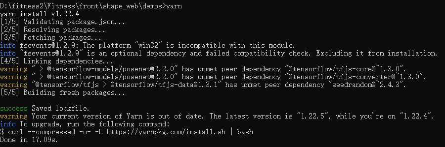
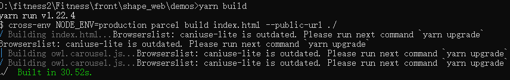
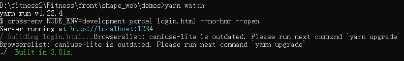
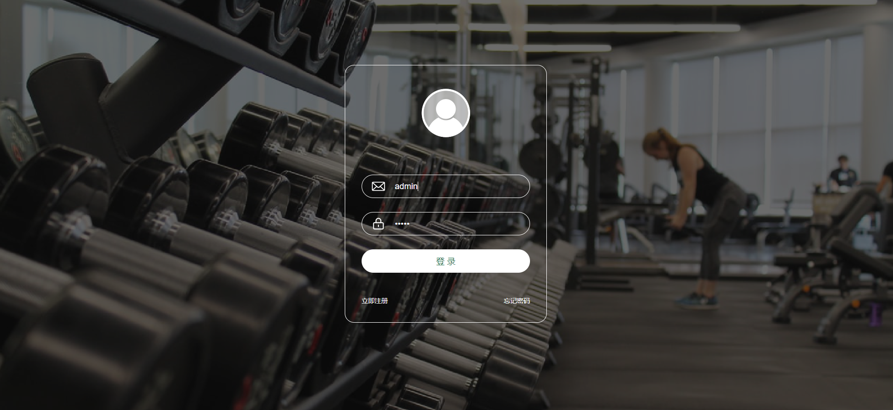
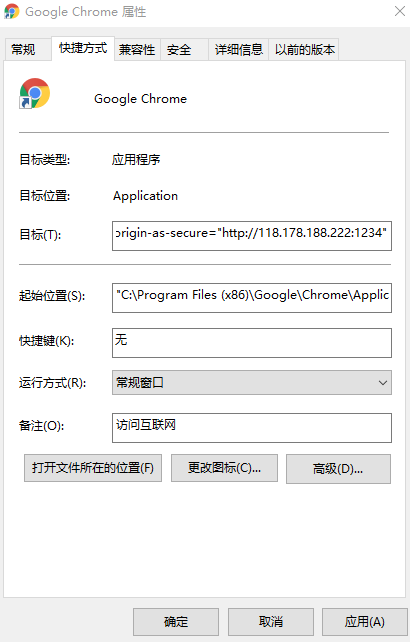

# Shape健身平台

## Sahara项目组基于posenet demo开发

**项目地址**：http://118.178.188.222:1234


## 安装及使用

安装node.js

安装地址：https://nodejs.org/zh-cn/

安装yarn

```
npm install -g yarn
```

cd 到指定文件夹

```sh
cd shape_web/demos
```

执行命令

```sh
yarn
yarn build
yarn watch
```

## 过程执行截图

yarn命令



yarn build命令



yarn watch命令



## 其他

默认登录口令

用户名：admiin

密码：admin



建议使用chrome打开使用该平台

不安全的http协议使用摄像头权限

右键点击chrome属性，在快捷方式中添加下面的代码



```
--unsafely-treat-insecure-origin-as-secure="http://118.178.188.222:1234"
```

